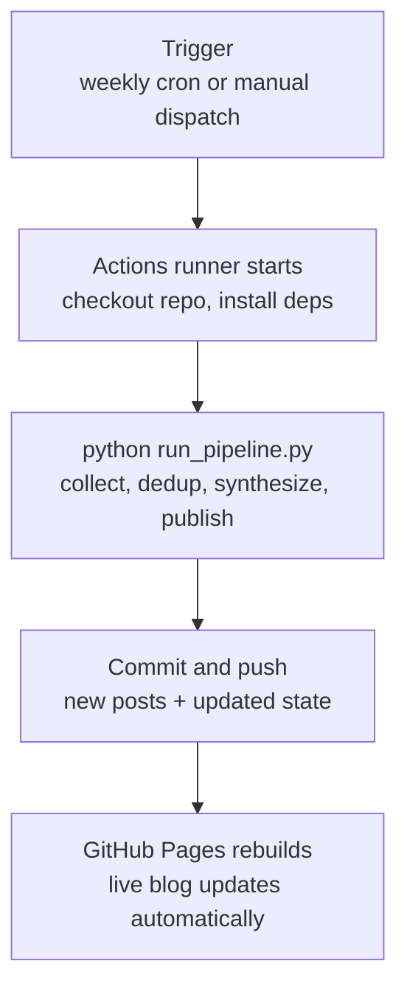

# AI insight agent

> This is the project's technical documentation. The live blog homepage is `index.md`, rendered at your GitHub Pages URL.

Autonomous, free-tools-only pipeline that checks for new AI capability
developments on a schedule, filters for genuine business relevance, and
publishes citation-grounded write-ups as a Jekyll-ready blog via GitHub Pages.

## Pipeline stages

```
pipeline/collect.py -> pipeline/dedup.py -> pipeline/synthesize.py -> pipeline/publish_gate.py -> pipeline/generate_report.py
```

All stage modules live under `pipeline/` (a proper Python package), wired
together by `run_pipeline.py` at the repo root -- the single entry point
the GitHub Actions workflow calls on a schedule.

Each stage is also runnable standalone for testing, but since they're
inside a package now, run them as modules from the repo root rather than
as plain scripts:

```
python -m pipeline.collect
python -m pipeline.dedup
python -m pipeline.synthesize
python -m pipeline.publish_gate
python -m pipeline.generate_report
```

(`python pipeline/collect.py` won't work -- it needs `-m` so Python sets
up the package import path correctly.)

## Local setup

```
pip install -r requirements.txt
export GEMINI_API_KEY="your-key-here"     # free tier: aistudio.google.com/apikey
python run_pipeline.py
```

Optional overrides (see config.py for details):
```
export GEMINI_MODEL=gemini-2.5-flash-lite   # swap models to manage quota
export TITLE_FILTER_METHOD=llm              # "keyword" (default) | "llm" | "none"
export MAX_POSTS_PER_CYCLE=3                # default 5
```

## GitHub Actions (automated weekly runs)



1. Push this repo to GitHub.
2. Add your Gemini key as a repo secret: Settings -> Secrets and variables
   -> Actions -> New repository secret -> name it `GEMINI_API_KEY`.
3. The workflow in `.github/workflows/weekly_run.yml` runs every Monday
   09:00 UTC, and can also be triggered manually from the Actions tab
   ("Run workflow" button, via `workflow_dispatch`).
4. To publish as an actual blog: Settings -> Pages -> deploy from branch
   -> select your default branch. `_config.yml`, `index.md`, and `_posts/`
   are already set up for Jekyll -- `index.md` is the site's actual
   homepage (not this README), with pagination configured at 5 posts/page.

Note: GitHub disables scheduled workflows on repos with no commits for
60 days. Push anything to reactivate it if that happens.

## Project Structure

```text
ai-insight-agent/
├── .github/
│   └── workflows/
│       └── weekly_run.yml
├── .gitignore
├── README.md              (dev docs)
├── _config.yml
├── index.md               (site homepage)
├── requirements.txt
├── run_pipeline.py        (entry point, stays at root)
├── pipeline/
│   ├── __init__.py
│   ├── config.py
│   ├── collectors.py
│   ├── collect.py
│   ├── dedup.py
│   ├── enrich.py
│   ├── llm_client.py
│   ├── title_filter.py
│   ├── synthesize.py
│   ├── publish_gate.py
│   └── generate_report.py
├── data/
│   ├── raw/            (gitignored, regenerable)
│   ├── processed/      (gitignored, regenerable)
│   └── state/
│       └── seen.json   (committed — pipeline's memory)
└── _posts/
    └── *.md             (generated posts)
```

## Design notes

- Every source fails independently (collectors.py) -- a broken feed logs
  a warning and is skipped, never crashes the run.
- Dedup state (data/state/seen.json) is only saved AFTER synthesis
  completes for a run's new items, so a mid-run crash doesn't silently
  mark unsent items as seen.
- Evidence extraction selects one to three claims with verbatim supporting
  excerpts from each source. Code checks every excerpt against the retrieved
  article before synthesis can use it; source metadata is still spliced in
  from the collector rather than trusting model-echoed citations.
- A critic scores each drafted insight for grounding, specificity, actionability,
  and safe value claims. It permits one constrained revision, then blocks any
  draft that is not approved before the existing publish gate runs.
- The publish gate then applies transparent code thresholds to final critic
  scores, ranks eligible insights by quality, caps the weekly volume, and
  records why any insight was held back.
- Title filter (title_filter.py) runs BEFORE enrichment/synthesis so
  irrelevant items (funding, hiring, legal news) never cost a network
  fetch or an LLM call.
- Publish gate caps output at MAX_POSTS_PER_CYCLE, ranked by confidence,
  so a heavy week doesn't dump too much content at once.

## Known limitations / next steps

- Source list (config.py) is currently thin, especially for
  Google/DeepMind and Meta -- expand once the pipeline is stable.
- HN items are signal-only (not synthesized directly) -- full-text
  fetching for HN-linked pages is a possible v2 addition.
- No cross-referencing between sources yet (e.g. detecting when Claude
  and Gemini ship similar capabilities in the same window).

## Client profiles (V2 foundation)

The `profiles/` directory holds reviewed business-context documents that
future insight stages will use to tailor recommendations. The current weekly
pipeline deliberately does **not** load a profile yet, so adding or editing a
profile cannot change published output unexpectedly.

Two example profiles are included:

- `consulting-firm` for a mid-market professional-services consulting firm
- `b2b-saas` for a growth-stage B2B SaaS company

Each JSON document must follow `profiles/client-profile.schema.json` and is
also validated by `pipeline.client_profiles`. Validate the examples locally
with:

```
python -m unittest tests.test_client_profiles
```
